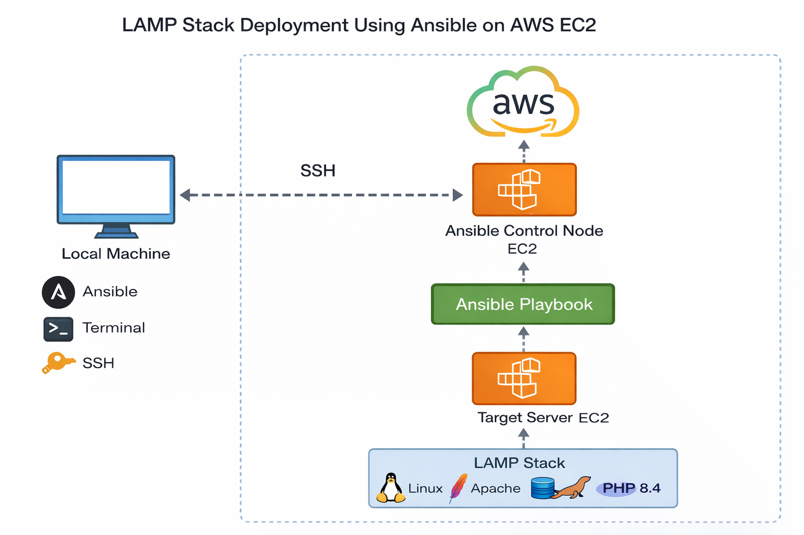

# 🚀 LAMP Stack Deployment Using Ansible on AWS EC2
  


## 📌 Project Overview
This project demonstrates automated deployment of a **LAMP Stack (Linux, Apache, MariaDB, PHP)** on an **AWS EC2 instance** using **Ansible**.

 .png)

The deployment is fully automated using Ansible playbooks and verified through a live PHP web page.

---

## 🧰 Technologies Used
- AWS EC2 (Amazon Linux 2023)
- Ansible
- Apache (httpd)
- MariaDB
- PHP 8.4
- Linux

---

## 🏗️ Architecture
```text
Local Machine
     |
     | SSH
     v
Ansible Control Node (EC2)
     |
     | Ansible Playbook
     v
Target Server (EC2)
     |
     |-- Apache
     |-- MariaDB
     |-- PHP
```
## 📷 Screenshots

### 1️⃣ LAMP Stack Successfully Deployed

  

### 2️⃣ Ansible Playbook Execution


   .png)


### 3️⃣ PHP Info Page
     
 .png)


## 📁 Project Structure
```
LAMP-Stack-Ansible/
├── inventory
├── vars.yml
├── lamp.yml
├── index.php
├── images/
└── README.md
```
## ▶️ How to Run
```
1️⃣ Install Ansible

sudo yum install ansible -y

2️⃣ Run Playbook

ansible-playbook lamp.yml
```
## ✅ Verification
```
http://<EC2_PUBLIC_IP>
```
You should see LAMP STACK SUCCESSFULLY DEPLOYED 

## 🌟 Key Learnings

    Ansible automation

    LAMP stack configuration

    AWS EC2 service management

    Infrastructure as Code

## 👩‍💻 Author

**Mansi Kadam**

DevOps Engineer

